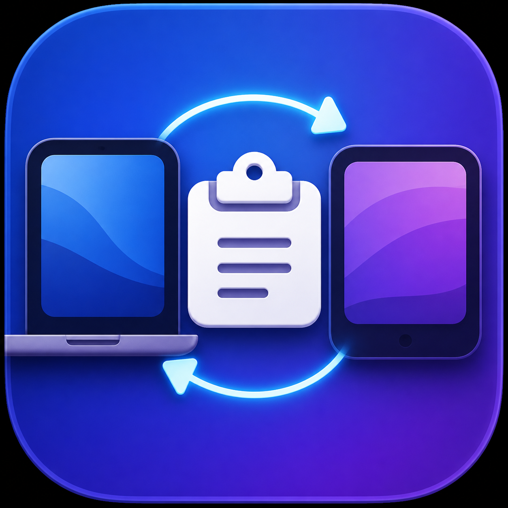

# macOS 共享剪贴板修复工具

[English](README.md)

<p align="center">
  
</p>

<p align="center">
  <a href="https://github.com/0xAAcodeislaw/macos-universal-clipboard-repair/releases/latest"></a>
  <a href="https://github.com/0xAAcodeislaw/macos-universal-clipboard-repair/releases"></a>
  <a href="https://github.com/0xAAcodeislaw/macos-universal-clipboard-repair/actions/workflows/build-app.yml"></a>
  <a href="https://github.com/0xAAcodeislaw/macos-universal-clipboard-repair/stargazers"></a>
  <a href="LICENSE"></a>
</p>

<p align="center"><a href="https://github.com/0xAAcodeislaw/macos-universal-clipboard-repair/releases/latest">下载最新 macOS App</a></p>

这是一个面向 macOS 的轻量级 Universal Clipboard（通用剪贴板）与 Handoff（接力）诊断、修复工具。

它不会替代苹果系统的共享剪贴板，也不会保存或同步剪贴板历史；它只观察相关系统状态，并执行有限、可逆的修复操作。

> 开箱即用：无需安装、无需 `sudo`，下载 Release 压缩包、解压后即可使用。App 包体约 **2.3 MB**，属于几 MB 级别的轻量工具；空闲运行时的实际内存会包含 macOS/AppKit 系统框架，当前本机实测约 **91 MB RSS**，不同系统版本会有所变化。

README 顶部的 `downloads` 徽章显示所有 GitHub Release 附件的累计下载量；进入 [Releases](https://github.com/0xAAcodeislaw/macos-universal-clipboard-repair/releases) 页面，还可以查看每个版本压缩包的单独下载次数。

## 故障现象（搜索关键词）

如果你遇到下面这些现象，本项目可能适合用来观察和修复。这里保留了常见中文、英文、系统服务名和参数名，方便通过 GitHub 或搜索引擎定位：

### 通用剪贴板与接力

- Mac、iPhone、iPad 之间无法复制粘贴
- 通用剪贴板失效、共享剪贴板不工作、跨设备复制粘贴失败
- Handoff（接力）失效，但设备仍然可以互相发现
- 复制后另一台设备没有出现接力提示，或者粘贴不到刚刚复制的内容
- `ClipboardSharingEnabled` 读取为 `0`、关闭或缺失
- `useractivityd`（接力服务）、`sharingd`（共享服务）或 `pboard`（本机剪贴板）状态异常

常见英文关键词：`Universal Clipboard not working`、`Handoff not working`、`shared clipboard between Mac and iPhone`、`clipboard sharing disabled`、`ClipboardSharingEnabled 0`、`useractivityd`、`sharingd`、`pboard`。

### 连续互通相机与共享摄像头

- Continuity Camera（连续互通相机、共享摄像头）无法使用
- 共享摄像头正常，但 Universal Clipboard / Handoff 仍然失效
- `magic`、`usable`、`nearby`、`wired` 状态异常或显示 `UNKNOWN`
- `ContinuityCaptureAgent` 没有运行、反复退出或状态不更新

常见英文关键词：`Continuity Camera not working`、`iPhone camera Mac`、`ContinuityCaptureAgent`、`magic usable nearby wired`。

### 代理与科学插件相关现象

- 翻墙工具、代理或科学插件运行时，Universal Clipboard / Handoff 偶尔失效
- 切换科学插件的“全局/规则”模式后，接力或共享剪贴板恢复
- 关闭代理后恢复，但重新开启后故障再次出现

本项目不会绑定某个具体代理软件名称；不同工具统一按“科学插件 / 系统代理”观察。

## 能做什么

- 查看 `ClipboardSharingEnabled` 是否开启
- 查看 `useractivityd`、`sharingd`、`pboard` 等相关服务是否运行
- 修复 Handoff / Universal Clipboard
- 查看并修复 Continuity Camera（连续互通相机）
- 显示 Wi‑Fi、蓝牙和系统代理状态
- 观察连续互通相机最近日志中的状态：

```text
magic:1
usable:1
nearby:1
wired:0
```

Handoff 和连续互通相机是两个独立的修复按钮，不会混在一起处理。

## 安全边界

本工具：

- 不需要 `sudo`
- 不退出 iCloud 或 Apple 账户
- 不重置网络
- 不修改钥匙串
- 不保存剪贴板内容
- 不主动发起网络请求

Handoff 修复只执行当前用户范围内的以下操作：

```sh
defaults delete ~/Library/Preferences/com.apple.coreservices.useractivityd.plist ClipboardSharingEnabled
defaults write ~/Library/Preferences/com.apple.coreservices.useractivityd.plist ClipboardSharingEnabled 1
killall useractivityd
killall sharingd
killall pboard
```

连续互通相机修复只重启 `ContinuityCaptureAgent`，并等待服务恢复。

## 使用科学插件时的提示

如果以上检查和修复都无法恢复，可以尝试切换科学插件的“全局/规则”模式，恢复之后大概率可以再切回全局模式。

不同科学插件的内部实现不同，因此本工具只显示系统代理状态，不能可靠读取每个插件内部的“全局/规则”模式。

## 本地编译

要求：

- macOS 13 或更高版本
- Apple Command Line Tools（包含 `clang`）

在仓库根目录执行：

```sh
./build-app.sh
open "build/Universal Clipboard Repair.app"
```

默认构建版本为 `1.0.0`。也可以指定版本号：

```sh
APP_VERSION=1.0.0 ./build-app.sh
```

## 用户端首次打开与 Gatekeeper 放行

当前仓库在没有签名凭据时仍会生成可审阅、可测试的未签名 App。首次从网络下载未签名版本时，如果 macOS 提示“无法验证开发者”、阻止打开，甚至建议“移到废纸篓”，请按以下步骤操作：

1. 从 GitHub Release 下载压缩包并解压，不要直接在压缩包预览窗口中运行。
2. 先双击 App 一次，让 macOS 记录这次拦截。
3. 打开 **系统设置 → 隐私与安全性**，滚动到“安全性”，点击 **仍要打开**，然后再次确认“打开”。这个按钮通常只会在刚刚尝试打开 App 后短时间出现。
4. 也可以在 App 上右键，选择 **打开**，再确认一次 **打开**。
5. 如果仍然没有“仍要打开”，并且你确认下载来源可信，可以在终端执行下面的命令。路径需要改成 App 的实际位置；如果 App 在“下载”文件夹中，可直接使用此示例：

   ```sh
   xattr -dr com.apple.quarantine "$HOME/Downloads/Universal Clipboard Repair.app"
   ```

   如果 App 名称或位置不同，请把命令最后的路径替换为实际路径。这个操作只移除当前文件的下载隔离标记，不会关闭整个 macOS 的 Gatekeeper。

完成一次放行后，通常就可以直接双击打开该 App。只对你确认来源可靠、文件未被篡改的版本执行上述操作。

要让普通用户下载后无需任何放行操作、真正双击即开，需要在仓库的 GitHub Actions Secrets 中配置 Developer ID Application 证书和 Apple 公证凭据。工作流已经预留了自动签名、公证和 stapling 流程；未配置时不会伪装成已签名版本。

## 使用 GitHub Actions 生成 App

1. 打开仓库的 **Actions** 页面。
2. 选择 **Build macOS App**。
3. 点击 **Run workflow**。
4. 填写版本号，例如 `1.0.0`。
5. 点击 **Run workflow**。
6. 在完成的任务页面下载 `Universal-Clipboard-Repair-v*-macOS` artifact。

推送版本标签（例如 `v1.0.0`）后，工作流会自动构建 App，并把压缩包附加到对应的 GitHub Release。

### 启用签名与公证

维护者可以在仓库设置中添加以下 Actions Secrets：

- `SIGNING_ENABLED`：填写 `true` 才启用签名流程
- `APPLE_CERTIFICATE_BASE64`：Developer ID Application `.p12` 证书的 Base64 内容
- `APPLE_CERTIFICATE_PASSWORD`：`.p12` 证书密码
- `APPLE_SIGNING_IDENTITY`：证书名称，例如 `Developer ID Application: Example (TEAMID)`
- `APPLE_ID`：用于公证的 Apple 账户
- `APPLE_TEAM_ID`：Apple Developer Team ID
- `APPLE_APP_PASSWORD`：该 Apple 账户的 App 专用密码

证书、密码和私钥只应保存为 GitHub Secrets，不要提交到仓库或贴到 Issue、README、聊天记录中。

## 开发说明

本项目的代码、界面、构建脚本和文档均由 **OpenAI Codex** 协作完成，并以公开源码、可审阅、可复现和可自行编译为目标。所有修复动作仍严格限定在 macOS 原生能力和本 README 所列的安全边界内。

## 项目定位

本项目专注于苹果系统原生 Continuity 服务的观察和修复，不是第三方剪贴板同步软件，也不是系统清理或网络代理工具。

## 参与项目

- [贡献指南](CONTRIBUTING.md)
- [更新日志](CHANGELOG.md)
- [报告故障](.github/ISSUE_TEMPLATE/bug-report.md)

## License

本项目采用 MIT License，详见 [LICENSE](LICENSE)。
